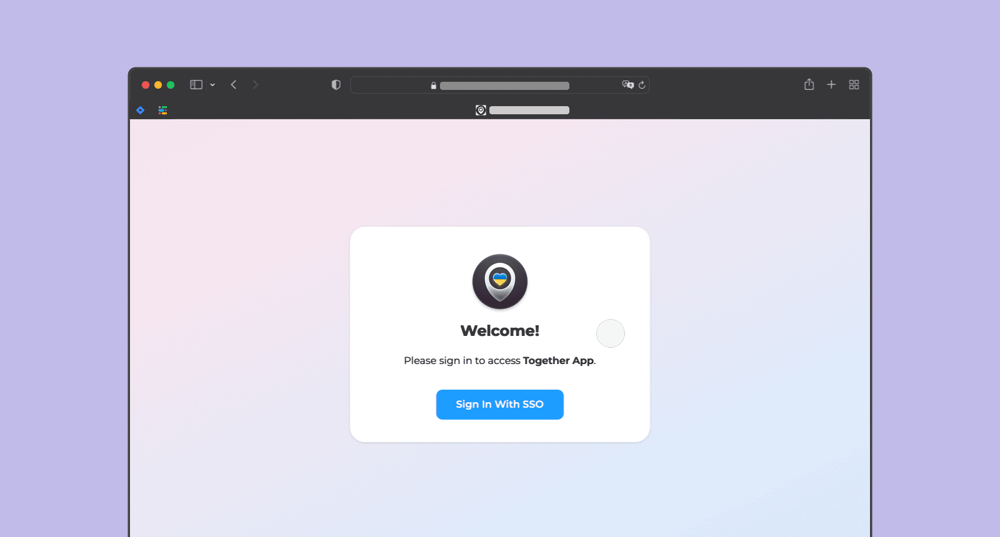
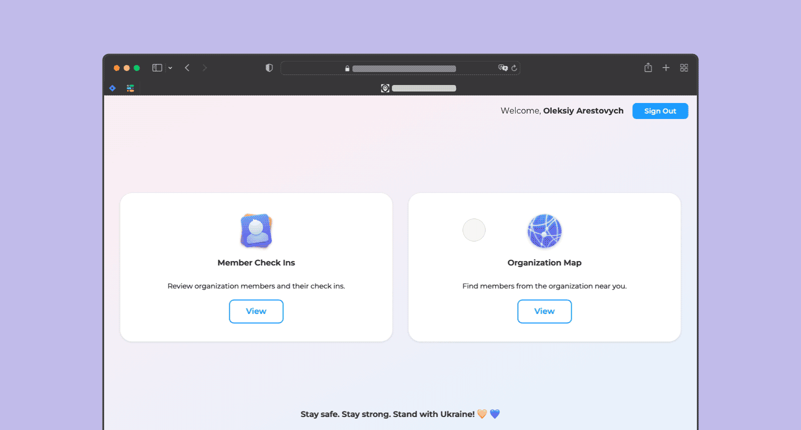

<p align="center">
    
</p>

<p align="center">
    <h3 align="center">Helping organizations stay together and help their members in times of disaster</h3>
</p>

<p align="center">
    On February 24th, 2022, the lives of the entire Ukrainian nation were disrupted and thrown into uncertainty because of the unprovoked, illegal invasion by the Russian Federation. As a result, millions have been dislocated and are at risk within war zones throughout Ukraine.
    <br />
    <br />
    Ukrainian businesses have become key in the resistance – providing aid to employees, coordinating humanitarian aid nation-wide, and contributing to anti-war initiatives, all while trying to keep their organizations viable.          
    <br />
    <br />
    <strong>Together App</strong> aims to help organizations be tight-knit communities for their members. It’s a simple way to know where your people are, to know when and how to help each other, and to have moments of real human connection when they are most needed.
    <br />
    <br />
    After all, we are in this <strong>together</strong>.     
    <br />
    <br />
    <a href="#floppy_disk--deploying-together-app"><strong>Deploying Together App</strong></a>
    ·
    <a href="#wrench--custom-app-configuration"><strong>Customization</strong></a>
    ·
    <a href="https://github.com/MacPaw/together-app/issues"><strong>Open a GitHub Issue</strong></a>
  </p>
</p>

***

<p align="center">
    <h3 align="center">Keep track of member well-being with daily check-ins.</h3>
</p>

<p align="center">
    In times of crisis, people move around quickly, connection gets disrupted, and safety conditions change rapidly. Every day, the <strong>Together App</strong> Slack bot asks members to check in – providing information about their whereabouts, wellbeing, and their ability to contribute to team efforts. 
</p>

<p align="center">
    The check-in only takes seconds but it provides a clear, actionable overview of organization members for the wellbeing stakeholders. Nobody is left behind and everybody is on the same page. 
</p>

<p align="center">
    
</p>

*** 

<p align="center">
    <h3 align="center">Stay secure – physically and digitally.</h3>
</p>

<p align="center">
    <strong>Together App’s</strong> check-in requests are sent to all members via its Slack bot. We use Slack because it’s a trusted and reachable tool for companies worldwide.
</p>

<p align="center">
    Additionally, the application never stores a member’s exact location to avoid collecting sensitive data like a refugee camp or bomb shelter in a city under attack. It stores only the coordinates of the actual city in which the member is located.
</p>

<p align="center">
    These protective measures are crucial now that many Ukrainian companies are withstanding constant cyber threats coming from Russia. With <strong>Together App</strong>, your company’s and your people’s data is safe.
</p>

<p align="center">
    
</p>

***

<p align="center">
    <h3 align="center">Know where your people are and coordinate with an interactive map.</h3>
</p>

<p align="center">
    In addition to providing a dashboard accessible for wellbeing stakeholders, <strong>Together App</strong> puts every team member on an interactive map. Using the map, members can see who is staying in the same city, meet up, and help each other. 
</p>

<p align="center">
    The map also became crucial for coordinating the logistics of humanitarian efforts and connecting members worldwide. Plus, it just feels good to see everybody at the same time, on the same map. 
</p>

<p align="center">
    
</p>

***

### :zap: &nbsp; What Can Together App Do?

* Automatically request wellbeing check-ins from organization members on a regular basis.
* Allow members to check in other peers who may not have connectivity if they know their current status.
* Repeat the previous wellbeing check-in in two taps if conditions haven't changed.
* Monitor member wellbeing, sending notifications to wellbeing stakeholders (HR, direct managers, etc.) when a member is at risk.
* Keep track of who has been mobilized. 
* Display check-in data for members in its thorough dashboard.
* Allow you to control who can see what data in the dashboard.
* Assist in building reports and queries based on check-in data for assisting members (i.e., "show me all of the members in Mykolaiv to help me coordinate an evacuation").
* Display an interactive map of an organization's members, allowing members to find help, community, and support in their current location.
* It respects privacy – members can opt-out of being displayed on the map, be exempt from checking in, and **Together App** will *never* save the exact location of any member. Although it uses browser geolocation to make the check-in process fast and effortless, only the coordinates of the member's city are stored in the database.  

***

### :computer: &nbsp; Usage

**Together App** has two key components:

* The **Together App** Slack bot.
* The **Together App** dashboard.

#### The Slack Bot

Aside from automatically requesting check-ins, members can proactively check in using the `/together` slash command and the **Together App** global shortcuts.

#### The Dashboard

Upon deploying your self-hosted version of **Together App**, a dashboard will be available on the domain, where you and other organization members can view members and their check-in data, as well as the interactive map.

Actual check-in data is limited to **Together App** administrators (which can be added in the dashboard), while the map is visible to all members of the organization who have access through your SSO or OAuth provider. 

***

### :floppy_disk: &nbsp; Deploying Together App 

Below is an in-depth guide on how you can deploy your own instance of **Together App** for your organization. This is intended to take no longer than an hour.

#### Before You Start

The following guide assumes that your organization already has:

* A Slack workspace.
* A single sign on (SSO) or OAuth provider (Okta, Google, etc.).

If you do not, you will need to set these up in order to use **Together App**.

This guide will walk you through deploying **Together App** on Heroku. However, almost all the steps here are globally true for and easily applied to any hosting.

#### Configure The Environment

Below is the list of required environment variables. Depending on where you are deploying **Together App**, these may need to be set either in the `.env` file or elsewhere (i.e. the Heroku dashboard).

This deployment guide will walk you through populating the values of the environment variables and will explain which each is used for.

```bash
NODE_ENV=
PORT=
HOST=
DATABASE_URL=
SLACK_TOGETHER_APP_TOKEN=
SLACK_TOGETHER_APP_SIGNING_SECRET=
SLACK_MONITORING_CHANNEL_ID=
SLACK_ORGANIZATION_CHANNEL_ID=
SLACK_WORKSPACE_ID=
TOGETHER_ADMINISTRATOR_SLACK_USER_ID=
GOOGLE_GEOCODING_API_TOKEN=
GOOGLE_PLACES_API_TOKEN=
MAPBOX_MAP_TOKEN=
OKTA_CLIENT_ID=
OKTA_CLIENT_SECRET=
OKTA_ISSUER=
NEXTAUTH_URL=
NEXTAUTH_SECRET=
ALLOWED_REFERRER_ID=
JOBS_API_TOKEN=
```

#### Create a Heroku Application

The easiest way to get started with **Together App** is to deploy it to Heroku.

* Create a new Heroku application according to [the documentation](https://devcenter.heroku.com/articles/getting-started-with-nodejs).
* Since **Together App** relies on Slack, due to response time allowances for Slack's events, it is recommended that you purchase a Hobby plan, so that the app does not sleep.
* Head to the **Settings** tab and, if needed, set up your custom domain (SSL and a Heroku domain are provided for free).
* There, in the **Settings** tab, click **Reveal Config Vars** to set up the environment. This is where you'll be setting all of the environment variables.
* Set the `HOST` and `NEXTAUTH_URL` to your custom or Heroku domain.
* Set the `NODE_ENV` to `production`. 
* Make sure that you *do not* set the `PORT` environment variable, as Heroku application ports are dynamic.

#### Set Up PostgreSQL

**Together App** requires a PostgreSQL database. 

* If you are working with Heroku, provision the [Heroku Postgres add-on](https://www.heroku.com/postgres).
* Once you do that, the `DATABASE_URL` environment variable is set for you.
* However, if you are not using Heroku Postgres, you will need to set the `DATABASE_URL` environment variable. 

#### Create The Slack Application

**Together App** integrates with Slack. It is there that your organization's members will receive check in requests and where member wellbeing stakeholders will receive notifications. The reasoning behind using Slack is that it is the most popular collaboration tool for organizations and is generally a very safe, trusted environment, which is important in light of currently heightened worries of phishing and other cyber attacks.

To create your Slack application:

* Copy the YML contents below to your clipboard (note the this is also available in the `manifest.yml` file in the [`slack`](https://github.com/MacPaw/together-app/tree/main/slack) folder.
* Make sure you replace the `{{host}}` variable with the domain on which you'll be hosting **Together App**.
* Follow the [instructions laid out by Slack](https://api.slack.com/reference/manifests) to install an app via an app manifest.
* Go to the app's **Basic Information** page, scroll to the bottom, and upload the app's icon. You can find the default **Together App** icon in the [`slack`](https://github.com/MacPaw/together-app/tree/main/slack) folder.
* Here, on the **Basic Information** page, click **Install to Workspace**.
* Once it has been installed, copy the **Signing Secret** from the app's **Basic Information** page to the `SLACK_TOGETHER_APP_SIGNING_SECRET`.
* Go to the **OAuth & Permissions** page and copy the **Bot User OAuth Token** to the `SLACK_TOGETHER_APP_TOKEN` environment variable.

:warning: Note that **Together App** has been created to work in a single Slack workspace. If your organization is on the Enterprise Grid, you will need to create an instance of **Together App** for each workspace.

```yaml
display_information:
  name: Together App
  description: An app to help us stay together during these tough times.
  background_color: "#36373d"
features:
  bot_user:
    display_name: Together App
    always_online: true
  shortcuts:
    - name: Check In Someone Else
      type: global
      callback_id: renderCheckInOtherMemberConfirmation
      description: Check in another member of your organization with Together App.
    - name: Check In
      type: global
      callback_id: renderCheckInSelfConfirmation
      description: Check in using Together App.
    - name: Repeat Last Check In
      type: global
      callback_id: renderRepeatCheckInConfirmation
      description: Repeat your last check in with Together App.
  slash_commands:
    - command: /together
      url: https://{{host}}/api/slack/command
      description: Call the Together App menu to check in.
      should_escape: false
oauth_config:
  scopes:
    bot:
      - commands
      - users:read
      - users:read.email
      - chat:write
settings:
  interactivity:
    is_enabled: true
    request_url: https://{{host}}/api/slack/action
  org_deploy_enabled: false
  socket_mode_enabled: false
  token_rotation_enabled: false
```

#### Configure Other Slack-Related Environment Variables

There is some other information from your Slack workspace that **Together App** needs in order to function.

Namely:

* The **Team ID** of your Slack workspace.
* The **Channel ID** of an organization-wide channel where check in requests will be sent.
* The **Channel ID** of a channel where **Together App** can send notifications to member wellbeing stakeholders.
* The **User ID** of the initial member who will have administrator privileges in **Together App**.

To get this information:

* Install the [**Slack Developer Tools** application](https://macpaw.slack.com/apps/APXEJ79UY-slack-developer-tools) from the Slack App Directory.
* Inside of the Slack client, open the [Shortcuts Menu](https://slack.com/help/articles/360057554553-Take-actions-quickly-with-shortcuts-in-Slack), and search for and click **Display IDs**.
* In the modal that opens, copy the value of **Your Workspace ID** to the `SLACK_WORKSPACE_ID` environment variable.
* In the same modal, find the member who will have initial administrator privileges and copy their ID to the `TOGETHER_ADMINISTRATOR_SLACK_USER_ID` environment variable.
* In the same modal, find the channel to which **Together App** should send organizational-wide check in requests and copy the ID to the `SLACK_ORGANIZATION_CHANNEL_ID` environment variable.
* Do the same to find the channel ID of the channel to which **Together App** can send notifications to member wellbeing stakeholders and copy the ID to the `SLACK_MONITORING_CHANNEL_ID` environment variable.

:warning: Make sure that **Together App** has been added to those channels.

#### Generate Google API Tokens

**Together App** uses two Google APIs to make the check in process as easy as possible – the [**Geocoding API**](https://developers.google.com/maps/documentation/geocoding/overview) and the [**Places API**](https://developers.google.com/maps/documentation/places/web-service/overview). You need to create API tokens for both.

Follow these steps:

* In order for **Together App** to work, you need to make sure that billing has been turned on and a payment method has been added. You can learn more about in [this documentation](https://cloud.google.com/billing/docs/how-to/payment-methods).
* Create an API key for the Geocoding API:
    * Create an API token.
    * In the **API restrictions** section, restrict the token to only the **Geocoding API**.
    * If you decide to further restrict the token using the **Application Restrictions**, note that this token is used on the back end, so using the **HTTP Referrer** restriction is not applicable. If you wish to restrict it for security reasons and you have a static IP address, you can restrict it by IP. 
* Copy the Geocoding API key to the `GOOGLE_GEOCODING_API_TOKEN` environment variable.  
* Create an API key for the Places API:
    * Create an API token.
    * In the **API restrictions** section, restrict the token to include both the **Places API** and the **Maps JavaScript API**.
    * Since this API key is exposed to the client, you need to restrict it by **HTTP Referrer** in the **Application Restrictions** section.
* Copy the Places API key to the `GOOGLE_PLACES_API_TOKEN` environment variable.

:warning: If you run into issues with detecting location while checking in, please go through the outlined restrictions above and double check that your tokens comply.

#### Generate a MapBox Public Key

**Together App** uses MapBox to render the interactive map of an organization's members. 

Follow these steps:

* Create an access token (that starts with `pk`) for MapBox according to their [documentation](https://docs.mapbox.com/accounts/guides/tokens/#default-public-access-token).
* Since the access token is exposed to the client, you'll want to [restrict it by URL](https://docs.mapbox.com/accounts/guides/tokens/#url-restrictions).
* Copy the MapBox access token to the `MAPBOX_MAP_TOKEN` environment variable.

#### Setting Up SSO or OAuth

Out of the box, **Together App** supports signing in with Okta as the main SSO provider. However, the app is built with [NextJS](https://nextjs.org), and the package [NextAuth](https://next-auth.js.org) supports multiple SSO and OAuth providers. 

In this section are the instructions for setting up Okta authentication. View the section on customizations to learn how to set up a custom provider.

To set up Okta authentication:

* Create [an OIDC custom app integration](https://help.okta.com/en/prod/Content/Topics/Apps/Apps_App_Integration_Wizard_OIDC.htm) for **Together App**.
* Set the redirect URL for the app to be `https://{{host}}/api/auth/callback/okta`.
* Find your [app's credentials](https://developer.okta.com/docs/guides/find-your-app-credentials/main/#find-your-app-integration-credentials), and copy in the **Client ID** to the `OKTA_CLIENT_ID` environment variable.
* Copy the **Client Secret** to the `OKTA_CLIENT_SECRET` environment variable.   
* Copy your organization's [Okta domain](https://developer.okta.com/docs/guides/find-your-domain/) to the `OKTA_ISSUER` environment variable.
* Provision access to your organization's members as needed. Note that priveleges are handled inside of the **Together App** and managed in the dashboard – not through Okta groups.
 
#### Setting Secrets

There are additional secrets that are needed for **Together App** to function. Each one is a random string. You can use key generators to create them:

* `NEXTAUTH_SECRET` – a random string used to hash tokens, sign/encrypt cookies and generate cryptographic keys.
* `ALLOWED_REFERRER_ID` – random string used to verify whether or not to render the check in page when redirected from Slack (other protection methods are in place, too).
* `JOBS_API_TOKEN` – a random string used to verify whether or not a request to the `https://{{host}}/api/jobs/*` endpoints are valid. These endpoints are used for scheduled jobs and do not return any data.

#### Turning On Heroku Auto Deploys 

Now that the environment has been populated, you're ready to deploy. 

First, we need to deploy the code to the Heroku app:

* Head over to the **Deploy** tab of your Heroku app.
* Configure GitHub integration.
* Select the forked repository in your GitHub account.
* Click **Deploy** branch.
* At this point, you will also want to install the [Heroku CLI](https://devcenter.heroku.com/articles/heroku-cli).

To view the build and deploy progress, open your **Terminal** and type in:

```bash
heroku logs -t -a {{heroku-app-name}}
```

#### Running Migrations

Before you can use **Together App**, you'll need to initiate the database scheme and seed data. 

First, open the command line within your Heroku application:

```bash
heroku run bash -a {{heroku-app-name}}
```

Then, to update the schema, run the following command inside the application:

```bash
npm run migrate:production
```

Then, you need to seed the data. Please note that your server needs to be up and running before running this command: 

```bash
npm run initialize
```

This command syncs the database with your Slack workspace and provides administrator permissions to the member whose Slack ID was set in the `TOGETHER_ADMINISTRATOR_SLACK_USER_ID` environment variable.

### Setting Up Scheduled Jobs

**Together App** relies on scheduled jobs for syncing users with your Slack workspace, sending check in requests, reminding members to check in, and notifying stakeholders about members who haven't checked in recently. 

These are invoked calling the following scripts:

* `npm run sync` – this syncs the **Together App** member base with your Slack workspace, importing newly added members and updating those with status changes (deleted, restricted, etc.).
* `npm run request` – this sends a check-in request message to the organization-wide channel and as a direct message to each member.
* `npm run remind` – this sends a check in reminder for members who haven't checked within a certain number of hours. This defaults to 24 hours, but is configurable.
* `npm run notify` – this sends a notification to the monitoring channel for members who haven't checked in within a certain number of hours. This defaults to 24 hours, but is configurable. 

To set these up on Heroku:

* For the app you created above, provision the free [Heroku Scheduler add-on](https://devcenter.heroku.com/articles/scheduler).
* Navigate to your app's **Overview** tab, and go to the Heroku Scheduler settings.
* Click **Add Job**.
* Choose a time interval and paste in the command from above.

Note that it is up to you how often and when to call these scripts. You might want to just request check-ins once per week. Aside from that, there are other customizations available, too.

An example algorithm for daily check-ins might be:

* 8:00 AM `npm run sync`
* 11:00 AM `npm run request`
* 14:00 PM `npm run remind`
* 16:00 PM `npm run notify`
* 11:00 PM `npm run sync`

This will:

* Keep your member database up to date.
* Request that members check in towards the start of the business day. 
* When members don't check in within three hours, remind them.
* Two hours later, notify stakeholders of members who are potentially off the grid or at risk.

But it's completely up to you and your organization. You will, however, want to call the `npm run sync` script at least once on a daily basis, at a time when most of your members are not active.

### Deploying Locally

**Together App** comes with a `docker-compose.yml` file to make it easy to deploy locally. Overall, most of the steps above apply to deploying locally. There are just a few changes needed to do so.

* Make sure that Docker is installed.
* Set up the environment variables in a `.env` file in the project's root.
* Set the `NODE_ENV` environment variable to `local`.
* Set the `DATABASE_URL` environment variable to `postgres://admin:admin@db:5432/together`.
* Set the `PORT` environment variable to `3000`.
* You'll need to use NGROK to proxy requests to the local host, since Slack requests are proxied from the client to the server. You can read more about this [here](https://slack.dev/node-slack-sdk/tutorials/local-development).
* Set the `HOST` and `NEXTAUTH_URL` environment variables to the NGROK host.
* You'll need to create a second Slack application, changing the host to the NGROK host in the provided URLs, and changing the name of the slash command.

Once you've set up the environment, open the **Terminal** and run the following commands.

To install dependencies: 

```bash
npm install
```

To build the project: 

```bash
npm run build
```

To start up the server:

```bash
docker-compose up
```

To sync the database schema, you first need to navigate to the container:

```bash
docker exec -it together sh
```

Then run the migrations:

```bash
npm run migrate:local
```

Then seed data. Please note that your server needs to be up and running before running this command:

```bash
npm run initialize
```

The same goes with scheduled tasks – they need to run inside of the Docker container.

***

### :wrench: &nbsp; Custom App Configuration

**Together App** has a few ways to customize the business logic for your instance. There are configuration files with type definitions location in `config/custom` that you can directly edit – the content of these files will not change with further releases.

#### Using a Custom SSO or OAuth Provider

Authentication is implemented using [NextAuth](https://next-auth.js.org), so **Together App** supports any of the authentication providers supported by [NextAuth](https://next-auth.js.org).

To use a provider other than the default Okta, you can add it to `config/custom/auth-provider-config.ts`:

```typescript
import type { Nullable, AuthProviderConfig } from '../../types';
import SlackProvider from 'next-auth/providers/slack';

const SLACK_CLIENT_ID = process.env.SLACK_CLIENT_ID!;
const SLACK_CLIENT_SECRET = process.env.SLACK_CLIENT_SECRET!;

export const authProviderConfig: Nullable<AuthProviderConfig> = {
  provider: SlackProvider({
    clientId: SLACK_CLIENT_ID,
    clientSecret: SLACK_CLIENT_SECRET,
  }),
  type: 'slack',
};
```

#### Slack Member Filtration Rules

By default, members that are either restricted or ultra-restricted in your Slack workspace will not be included in check-in requests, the dashboard, or the map. They won't be able to check in or access data.

This can be configured by modifying `config/custom/filter-slack-member-rule.ts`:

```typescript
import type { Nullable, FilterSlackMemberRule } from '../../types';

export const filterSlackMemberRule: Nullable<FilterSlackMemberRule> = {
  filterRestricted: false, // Restricted members will also be in Together App
  filterUltraRestricted: true,
};
```

#### Check In Request Configuration

By default, when the scheduled job `npm run request` is invoked, a request is sent to both the organization-wide channel and to each member as a direct message, from the Slack app.

This can be configured by modifying `config/custom/check-in-request-rule.ts`:

```typescript
import type { Nullable, CheckInRequestRule } from '../../types';

export const checkInRequestRule: Nullable<CheckInRequestRule> = {
  requestCheckInDirectMessage: false, // The message will not be sent as a direct message
  requestCheckInOrganizationChannel: true,
};
```

#### Notification Configuration

By default, when running the `npm run notify` scheduled job, **Together App** notifies you in the monitoring channel about members that haven't checked in within the 24 hours previous to the job being invoked.

This can be configured by modifying `config/custom/notify-if-not-checked-in-within-rule.ts`:

```typescript
import type { Nullable, NotifyOfLateCheckInRule } from '../../types';

export const notifyIfNotCheckedInWithinRule: Nullable<NotifyOfLateCheckInRule> = { 
  hours: 12, // Will notify stakeholders of members not checked in within last 12 hours
};
```

#### Reminder Configuration

By default, when running the `npm run remind` scheduled job, **Together App** queries members who have not checked in within the last 24 hours and sends each one a reminder, requesting a check in.

This can be configured by modifying `config/custom/remind-if-not-checked-in-within-rule.ts`:

```typescript
import type { Nullable, RemindMemberOfLateCheckInRule } from '../../types';

export const remindIfNotCheckedInWithinRule: Nullable<RemindMemberOfLateCheckInRule> = {
  hours: 48, // Will remind members not checked in within last 48 hours to check in
};
```

#### Member At Risk Criteria

Every time a member checks in **Together App** determines whether or not the member is at risk or in need of assistance, and sends a notification to the monitoring channel. 

By default, it considers a member at risk if they meet one of the following criteria:

* Have checked themselves in as not being in a safe place
* Have been mobilized
* Have not checked in within the past 24 hours

This can be configured by declaring a function in `config/custom/member-is-at-risk-rule.ts`:

```typescript
import type { Nullable, MemberIsAtRiskRule } from '../../types';
import type { Member } from '../../entities';

export const memberIsAtRiskRule: Nullable<MemberIsAtRiskRule> = (member: Member): boolean => {
  const isSafe = member.checkIn && member.checkIn.isSafe;
  const isNotMobilized = !member.isMobilized; 

  return !Boolean(isSafe && isNotMobilized); // No check in within 24 hours is no longer considered at risk
};
```

#### Custom Logger

By default, **Together App** uses `console.log()` for errors. You can also declare your own logger that complies to the provided `Logger` interface:

```typescript
import type { Logger } from '@slack/logger';
import type { Nullable } from '../../types';
import SomeLogger from '../../logger';

export const logger: Nullable<Logger> = new SomeLogger();
```

***

### :ukraine: &nbsp; Authors

 Ray East ([@raycharius](https://github.com/raycharius))

 Vadym Grabovyi ([@hraboviyvadim](https://github.com/hraboviyvadim))

 Boris Zagorodniy ([@BZahorodnii](https://github.com/BZahorodnii))
 
 Taras Neporozhniy ([@korywka](https://github.com/korywka))

 Alexey Chernyshov ([@ft502](https://dribbble.com/ft502))


